# Cross-Platform Zsh Development Environment


Tired of manually setting up your development environment on every new machine? This repository contains a set of Zsh dotfiles that create a unified, powerful, and automated workflow across **macOS, Linux, and Windows (via WSL)**.

It is built around a modern toolchain that prioritizes speed, consistency, and developer experience. By using the provided functions, you can bootstrap, manage, and work with complex Python, Node.js, and Docker-based projects using simple, memorable commands.

## Key Features

- **💻 Cross-Platform by Design**: Works seamlessly on macOS, Linux, and WSL with OS-specific adaptations handled automatically.
- **🚀 Automatic Onboarding**: On a fresh system (macOS, Linux, or WSL), the script detects missing tools and interactively prompts to install them. Run `run_onboarding` anytime to re-check.
- **🤖 Automated Project Scaffolding**: Create complete, best-practice Python (`python_new_project`) or Node.js (`node_new_project`) projects with a single command.
- **✨ Seamless Environment Management**:
  - **`direnv`** for automatic activation/deactivation of Python virtual environments.
  - **`nvm`** with automatic Node.js version switching via `.nvmrc` files.
- **🐳 Integrated Docker Helpers**: Functions to quickly start, stop, and manage common development services like PostgreSQL, Qdrant, and Jupyter Lab.
- **🖥️ Tmux Integration**: Powerful tmux session management with git-aware workflows and automatic window naming.
- **📝 Editor Integration**: Automatic environment syncing between Cursor/VSCode terminals and tmux sessions.
- **🎬 Media Tools**: Built-in `yt()` wrapper for yt-dlp with auto-generated configuration and quality presets.
- **🔒 Private Configuration**: A built-in pattern for managing your secret keys and machine-specific settings in a `.zshrc.private` file, which is kept out of version control.

---

## Prerequisites for Mac

1. **Homebrew**: Ensure [Homebrew](https://brew.sh/) is installed on your macOS system.
2. **Core Tools**: Install the essential technologies using Homebrew.

   ```bash
   brew install uv direnv jq zoxide eza fzf tmux ripgrep fd gh git-lfs
   ```

   > **Note:** `jq` is used by Node.js scaffolding and onboarding checks. `zoxide` replaces `cd`, `eza` powers the `l`/`ll` aliases, `fzf` provides fuzzy finding, `tmux` powers session management, `ripgrep` (`rg`) enables fast code search, `fd` is a fast `find` alternative, `gh` is the GitHub CLI (used by `.gitconfig` for credential management), and `git-lfs` enables Git Large File Storage.

3. **Recommended Tools**: These are optional but enhance the experience significantly.

   ```bash
   brew install ffmpeg yt-dlp aria2 tree neofetch lazygit lazydocker yazi imagemagick
   ```

   > **Note:** `ffmpeg` and `aria2` are used by the `yt()` media download wrapper. `lazygit`/`lazydocker` power the `lg`/`lzd` aliases. `yazi` is a terminal file manager used by the `y()` function. `imagemagick` is required by the yazi zoom plugin for image resizing.

4. **Nerd Font**: Required for Powerlevel10k icons and glyphs.

   ```bash
   brew install --cask font-symbols-only-nerd-font
   ```

5. **Post-install Setup**: Run these one-time setup commands after installing the tools above.

   ```bash
   git lfs install                    # One-time git-lfs setup (configures hooks)
   gh auth login                      # Authenticate GitHub CLI (used by .gitconfig credential helper)
   ```

---

## Installation

Setting up is designed to be as simple as possible. The included `install.sh` script handles everything interactively, or you can set things up manually.

### Automated Install (Recommended)

```bash
git clone https://github.com/CaptainCodeAU/fifty-shades-of-dotfiles.git ~/fifty-shades-of-dotfiles
cd ~/fifty-shades-of-dotfiles
./install.sh
```

The installer will check prerequisites, install missing tools, set up Oh My Zsh plugins, symlink dotfiles via GNU Stow, configure git identity, install TPM/nvm/pnpm/bun/Nerd Fonts, and more. Run `./install.sh --help` for all options including `--check`, `--dry-run`, `--update`, and `--force`.

### Manual Install

1. **Prerequisites**:
   - Ensure `git` and `zsh` are installed.
   - Install **[Oh My Zsh](https://ohmy.zsh.sh/#install)**.

2. **Clone the Repository**:

   ```bash
   git clone https://github.com/CaptainCodeAU/fifty-shades-of-dotfiles.git ~/fifty-shades-of-dotfiles
   ```

3. **Symlink Configuration (optional)**: Link the configuration files to your home directory using the one-to-one mapping structure.

   ```bash
   # WARNING: This will overwrite existing files. Backup yours first!
   # Link main zsh configuration
   ln -sf ~/fifty-shades-of-dotfiles/home/.zshrc ~/.zshrc

   # Link zsh function files
   ln -sf ~/fifty-shades-of-dotfiles/home/.zsh_python_functions ~/.zsh_python_functions
   ln -sf ~/fifty-shades-of-dotfiles/home/.zsh_node_functions ~/.zsh_node_functions
   ln -sf ~/fifty-shades-of-dotfiles/home/.zsh_docker_functions ~/.zsh_docker_functions
   ln -sf ~/fifty-shades-of-dotfiles/home/.zsh_cursor_functions ~/.zsh_cursor_functions
   ln -sf ~/fifty-shades-of-dotfiles/home/.zsh_tmux ~/.zsh_tmux
   ln -sf ~/fifty-shades-of-dotfiles/home/.zsh_onboarding ~/.zsh_onboarding
   ln -sf ~/fifty-shades-of-dotfiles/home/.zsh_welcome ~/.zsh_welcome

   # Link git configuration
   # Option A: Copy and fill in your personal info
   cp ~/fifty-shades-of-dotfiles/home/.gitconfig ~/.gitconfig
   git config --global user.name "Your Name"
   git config --global user.email "you@example.com"
   # Option B: Include from your existing ~/.gitconfig (add to [include] section)
   # git config --global include.path ~/fifty-shades-of-dotfiles/home/.gitconfig
   ln -sf ~/fifty-shades-of-dotfiles/home/.gitignore_global ~/.gitignore_global

   # Link other configuration files
   ln -sf ~/fifty-shades-of-dotfiles/home/.tmux.conf ~/.tmux.conf
   ln -sf ~/fifty-shades-of-dotfiles/home/.p10k.zsh ~/.p10k.zsh
   ln -sf ~/fifty-shades-of-dotfiles/home/.vimrc ~/.vimrc

   # Link .config directory files
   mkdir -p ~/.config/direnv ~/.config/yt-dlp
   ln -sf ~/fifty-shades-of-dotfiles/home/.config/direnv/direnvrc ~/.config/direnv/direnvrc
   ln -sf ~/fifty-shades-of-dotfiles/home/.config/direnv/direnv.toml ~/.config/direnv/direnv.toml
   ln -sf ~/fifty-shades-of-dotfiles/home/.config/yt-dlp/config ~/.config/yt-dlp/config
   ln -sf ~/fifty-shades-of-dotfiles/home/.config/yazi ~/.config/yazi

   # Link platform-specific files (macOS only)
   # mkdir -p ~/Library/Application\ Support/Cursor/User
   # mkdir -p ~/Library/Application\ Support/Code/User
   # ln -sf ~/fifty-shades-of-dotfiles/platforms/macos/Library/Application\ Support/Cursor/User/settings.json ~/Library/Application\ Support/Cursor/User/settings.json
   # ln -sf ~/fifty-shades-of-dotfiles/platforms/macos/Library/Application\ Support/Code/User/settings.json ~/Library/Application\ Support/Code/User/settings.json
   ```

   > **Note**: The repository uses a one-to-one mapping structure where `home/` mirrors `~/` and `platforms/` contains platform-specific files. See [`docs/STRUCTURE.md`](docs/STRUCTURE.md) for details.

4. **Node.js Ecosystem**: Install nvm, pnpm, and TPM for tmux plugins.

   ```bash
   # nvm (Node Version Manager)
   curl -o- https://raw.githubusercontent.com/nvm-sh/nvm/v0.40.3/install.sh | bash

   # pnpm (standalone install — used instead of Corepack)
   curl -fsSL https://get.pnpm.io/install.sh | sh -

   # bun (JavaScript runtime & toolkit)
   # Pre-set BUN_INSTALL and PATH so the installer skips modifying .zshrc
   export BUN_INSTALL="$HOME/.bun" && export PATH="$BUN_INSTALL/bin:$PATH" && curl -fsSL https://bun.sh/install | bash

   # TPM (Tmux Plugin Manager) — required for tmux plugins in .tmux.conf
   git clone https://github.com/tmux-plugins/tpm ~/.tmux/plugins/tpm
   # After starting tmux, press prefix + I to install plugins
   ```

5. **Enable `direnv`**: The provided `.zshrc` already contains the hook for `direnv`. If you are merging with an existing file, ensure this line is present:

   ```zsh
   # In your .zshrc
   if command -v direnv &> /dev/null; then eval "$(direnv hook zsh)"; fi
   ```

6. **Restart Your Shell**: Open a new terminal window or run `source ~/.zshrc`.
   - **On any new system**, the onboarding script will run automatically and guide you through installing any missing dependencies.
   - A welcome message will confirm the setup is active.

---

## Onboarding & Dependency Management

The shell includes an automatic onboarding system that checks for required tools and offers to install them.

### Automatic Onboarding

On first shell start (on a new machine), the onboarding script runs automatically and:

1. Detects your OS and package manager
2. Checks for essential development tools
3. Offers to install missing tools interactively

### Manual Onboarding

Re-run onboarding anytime to check for missing tools:

```bash
run_onboarding
```

### Supported Package Managers

| OS            | Package Manager                     |
| ------------- | ----------------------------------- |
| macOS         | Homebrew (auto-installs if missing) |
| Ubuntu/Debian | apt                                 |
| Fedora        | dnf                                 |
| Arch          | pacman                              |
| openSUSE      | zypper                              |

### Tools Checked

| Category                 | Tools                                                 |
| ------------------------ | ----------------------------------------------------- |
| **Essential**            | git, curl, unzip                                      |
| **User Experience**      | eza, fzf, jq, direnv, zoxide, fd, yazi                |
| **CLI Tools**            | ripgrep, tree, neofetch, ffmpeg, yt-dlp, aria2        |
| **Git**                  | gh, git-lfs                                           |
| **Development Managers** | nvm, uv, bun                                          |
| **Special**              | Docker (guidance only — requires manual installation) |

### Skipping Onboarding

To prevent auto-onboarding on a fresh shell:

```bash
export _ONBOARDING_COMPLETE=true
```

---

## Usage: Your Day-to-Day Python Workflow

### 1. Creating a New Python Project

This is the primary entry point. The function scaffolds everything you need.

```bash
# 1. Create and enter a directory for your new project
mkdir my-awesome-app && cd my-awesome-app

# 2. Run the new project command with the desired Python version
python_new_project 3.12
```

This single command performs over a dozen steps, including `git init`, `uv venv`, `uv pip install`, and creating all necessary config files.

### 2. Setting Up an Existing Project

If you clone a project or need to reset your environment, use `python_setup`. This function intelligently installs default `dev` dependencies and any other optional extras you specify.

```bash
# 1. Clone a repo and enter it
git clone <url> && cd <project-name>

# 2. Set up the environment using a specific Python version
# This will install base + 'dev' dependencies.
python_setup 3.12

# 3. Set up the environment and include additional optional dependencies
# This will install base + 'dev' + 'api' + 'web' dependencies.
python_setup 3.12 api web
```

### 3. Managing a Global Command-Line Tool

If your `pyproject.toml` defines a script, you can install it as a system-wide command using `uv tool`. The install uses **editable mode** by default, so code changes are reflected immediately without reinstalling. These helpers require an active virtual environment to determine which Python version to use.

```bash
# Inside your project directory (with .venv active via direnv):

# Install the tool for the first time with 'cli' extras (editable mode)
uv_tool_install_current_project cli

# Install with NO extras
uv_tool_install_current_project --no-extras

# Reinstall (only needed when pyproject.toml entry points change)
uv_tool_reinstall_current_project cli

# Check the installation status of the current project's tool
uv_tool_check_current_project

# Uninstall the tool
uv_tool_uninstall_current_project

# Run a tool once without installing (via uvx)
uvx ruff check .
```

### 4. Cleaning Up a Project

To completely remove all generated artifacts and return the directory to a clean state, use `python_delete`. This is non-destructive to your source code.

```bash
# This will remove .venv, .envrc, caches, build artifacts, and uv.lock
python_delete
```

---

## Python Workflow at a Glance

This environment supercharges Python development using `uv` and `direnv`.

### 1. New Project Scaffolding (`python_new_project`)

```mermaid
graph TD
    subgraph "🚀 Initial Setup"
        A["💻 User runs:<br><b>mkdir my-app && cd my-app</b>"] --> B
        B["💻 User runs:<br><b>python_new_project 3.12</b>"]
    end

    subgraph "🤖 Automated Scaffolding"
        B --> C{"⚙️ `uv init`, `git init`"}
        C --> D["📄 pyproject.toml<br>📄 .gitignore<br>📄 README.md"]
        C --> E["📁 src/my_app/__init__.py<br>📁 tests/test_main.py"]
        C --> F["🐍 `uv venv`<br>Creates .venv"]
        F --> G["📦 `uv pip install -e .[dev]`<br>Installs dependencies"]
        C --> H["🗝️ `direnv`<br>Creates .envrc for auto-activation"]
    end

    subgraph "✅ Result"
        I["✨ A complete, ready-to-develop<br>Python project with one command."]
    end

    D & E & G & H --> I

    classDef userAction fill:#3498db,stroke:#2980b9,stroke-width:2px,color:white;
    classDef automation fill:#f1c40f,stroke:#f39c12,stroke-width:2px,color:black;
    classDef artifact fill:#2ecc71,stroke:#27ae60,stroke-width:2px,color:white;
    classDef result fill:#9b59b6,stroke:#8e44ad,stroke-width:2px,color:white;

    class A,B userAction;
    class C,F,G,H automation;
    class D,E artifact;
    class I result;
```



### 2. Existing Project Setup (`python_setup`)

```mermaid
graph TD
    subgraph "🚀 Initial State"
        A["📁 Existing Project<br>(e.g., after `git clone`)"]
    end

    subgraph "🤖 Automated Setup"
        A --> B["💻 User runs:<br><b>python_setup 3.12 api</b>"]
        B --> C["🗑️ Removes existing `.venv` folder"]
        C --> D["🐍 Creates new `.venv` using<br>the specified Python version (3.12)"]
        D --> E["📦 Installs dependencies from `pyproject.toml`<br>including `[dev]` and specified extras (`[api]`)"]
        E --> F["🗝️ Ensures `.envrc` exists for `direnv`"]
    end

    subgraph "✅ Result"
        G["✨ A clean, consistent, and<br>ready-to-use development environment."]
    end

    F --> G

    classDef userAction fill:#3498db,stroke:#2980b9,stroke-width:2px,color:white;
    classDef automation fill:#e67e22,stroke:#d35400,stroke-width:2px,color:white;
    classDef initialState fill:#95a5a6,stroke:#7f8c8d,stroke-width:2px,color:white;
    classDef result fill:#9b59b6,stroke:#8e44ad,stroke-width:2px,color:white;

    class A initialState;
    class B userAction;
    class C,D,E,F automation;
    class G result;
```



### 3. Global CLI Deployment (`uv_tool_*`)

```mermaid
graph TD
    subgraph "🔄 Daily Development Cycle"
        A["💻 `cd my-project`"] --> B
        B["✨ `direnv` auto-activates<br>the `.venv` environment"]
        B --> C["👨‍💻 Write code, run `pytest`, `ruff format`..."]
    end

    subgraph "🌍 Global CLI Deployment (Optional)"
        C --> F["Run: `uv_tool_install_current_project cli`"]
        F --> G["✅ `my-cli` is now available globally<br>(editable — code changes apply immediately)"]
        G --> H["... make code changes ..."]
        H --> I["Run: `uv_tool_reinstall_current_project cli`<br>(only if entry points change)"]
    end
```



### 4. Daily Development & Deployment

This diagram shows the seamless daily workflow enabled by `direnv` and the `uv tool` helper functions.

```mermaid
graph TD
    subgraph "🔄 Daily Development Cycle"
        A["💻 `cd my-project`"] --> B
        B["✨ `direnv` auto-activates<br>the `.venv` environment"]
        B --> C["👨‍💻 Write code, run `pytest`, `ruff format`..."]
        C --> D["💻 `cd ..`"]
        D --> E["✨ `direnv` auto-deactivates<br>the `.venv` environment"]
    end

    subgraph "🌍 Global CLI Deployment (Optional)"
        C --> F["Run: `uv_tool_install_current_project cli`<br>to install with 'cli' extra (editable)"]
        F --> G["✅ `my-cli` is now available globally"]
        G --> H["... make code changes ..."]
        H --> I["Run: `uv_tool_reinstall_current_project cli`<br>to update (only if entry points change)"]
        I --> J["Run: `uv_tool_uninstall_current_project`<br>to remove the global command"]
    end

    classDef userAction fill:#3498db,stroke:#2980b9,stroke-width:2px,color:white;
    classDef tool fill:#e67e22,stroke:#d35400,stroke-width:2px,color:white;
    classDef devLoop fill:#1abc9c,stroke:#16a085,stroke-width:2px,color:white;
    classDef result fill:#9b59b6,stroke:#8e44ad,stroke-width:2px,color:white;

    class A,D,F,H,I,J userAction;
    class B,E tool;
    class C devLoop;
    class G result;
```



---

## Node.js & Docker Workflows

### Node.js (`node_*` functions)

The setup provides similar automation for Node.js projects, standardizing on `nvm`, `pnpm`, and Corepack. Projects scaffold with **TypeScript by default** (pass `--no-ts` for JavaScript), use **Vitest** for testing, and integrate with **direnv** for automatic environment activation.

- **Create a new TypeScript project**: `mkdir my-node-app && cd my-node-app && node_new_project`
  - Scaffolds `src/index.ts`, `tests/index.test.ts`, `tsconfig.json`, `.nvmrc`, `.gitignore`, and a rich `.envrc` (if direnv is available). Installs TypeScript, Vitest, ESLint, Prettier, and `@types/node`.
- **Create a JavaScript project**: `node_new_project --no-ts`
  - Same scaffold without TypeScript — creates `src/index.js` and `tests/index.test.js` instead.
- **Set up an existing project**: `cd existing-project && node_setup`
  - Switches to the Node version from `.nvmrc`, installs dependencies with `pnpm install`, creates `.envrc` if missing, and displays available scripts.
- **Quick project dashboard**: `node_info`
  - Shows Node/npm/pnpm/Corepack versions, `.nvmrc` status, package.json details, available scripts, and global link status.
- **Clean up artifacts**: `node_clean`
  - Removes `node_modules`, `dist`, `build`, `.next`, `.turbo`, `.tsbuildinfo`, coverage, caches, and lockfiles.

#### Global Node.js Package Management

For CLI tools you're developing, use `node_link` / `node_unlink` / `node_check_global` to manage global symlinks via `pnpm link --global`. Note that global links are tied to the current nvm Node version — switching nvm versions will lose access to the linked binary. For one-off tool execution, use `pnpm dlx` which doesn't require global installation. (`npx` is intercepted and will suggest the `pnpm dlx` equivalent.)

### Docker (`docker_*` functions & aliases)

Quickly manage common development services and stacks.

- **Start a PostgreSQL container for development**: `pg_dev_start [db] [pw] [port]`
- **Start a Qdrant vector database**: `qdrant_start [port]`
- **Start a full AI/ML stack (Qdrant + Jupyter)**: `dev_stack_start ai`
- **Start a web development stack**: `dev_stack_start web`
- **Start a full stack (web + AI/ML)**: `dev_stack_start full`
- **Check the status of all services**: `dev_stack_status`
- **Clean up all unused Docker resources**: `dcleanup`
- **View Docker overview**: `docker_overview`
- **Get help**: `docker_help`

### Tmux Workflows

The configuration includes powerful tmux session management:

- **Quick session access**: `ta mysession` (attach or create)
- **Coding sessions**: `tc` (coding session), `tcc` (claudecode session)
- **Development sessions**: `tdev myproject` (multi-window setup)
- **Git-aware sessions**: `tgit myproject` (split panes for git and editing)
- **Git integration**: All git branch operations automatically update tmux window names

### Media Downloads

Use the `yt()` wrapper for easy video/audio downloads:

```bash
yt https://youtube.com/watch?v=...              # Default: 1080p + best audio
yt --video-highest https://youtube.com/watch?v=... # Maximum quality
yt --audio-only https://youtube.com/watch?v=...    # Extract audio
yt --bundle https://youtube.com/watch?v=...        # Video + all metadata
yt --help                                          # Show all options
```

---

## Claude Code LSP Servers

Claude Code supports LSP (Language Server Protocol) plugins for enhanced code intelligence. These servers need to be installed globally on the system so Claude Code can find them on `$PATH`.

### LSP Server Setup

```bash
# Pyright (Python) — installed via uv tool
uv tool install pyright

# TypeScript Language Server — installed via pnpm global
pnpm add -g typescript-language-server typescript

# Swift (sourcekit-lsp) — ships with Xcode, no install needed
# Verify with: /usr/bin/sourcekit-lsp --help
```

### Verification

```bash
pyright --version                    # Should show version (e.g., 1.1.408)
typescript-language-server --version # Should show version (e.g., 5.1.3)
which sourcekit-lsp                  # Should show /usr/bin/sourcekit-lsp
```

---

## Claude Code Configuration

This repository includes a comprehensive [Claude Code](https://code.claude.com/) setup in the `.claude/` directory.

### Installing Claude Code

Claude Code is a CLI tool from Anthropic. Install it following the [official documentation](https://docs.anthropic.com/en/docs/claude-code/overview). Once installed, the shell aliases (`c`, `cb`, `cr`, `ci`, `ct`, `cd_`, `cskip`) defined in `.zshrc` will work.

### Optional Tools for Hooks

The Claude Code hooks in this repo benefit from these optional tools:

```bash
# markdownlint — used by pre-commit gate for markdown auto-fix
brew install markdownlint-cli

# dotenvx — used by session-checks.sh to verify .env encryption
brew install dotenvx/brew/dotenvx
```

### Permissions (`.claude/settings.local.json`)

The local settings file configures fine-grained permissions using the modern `Bash(command *)` wildcard syntax:

- **`allow`**: Pre-approved commands for common shell utilities, git operations, Swift/Xcode tooling, package managers (uv, pnpm, brew, cargo, pip, pod), Docker, GitHub CLI, and more.
- **`ask`**: Prompts before running destructive operations like `git push` and `git reset`.
- **`deny`**: Blocks reading sensitive files — `.env` variants (except `.env.example`), private keys (`.pem`, `.key`, `.cert`), `~/.ssh/`, `~/.aws/`, `~/.gnupg/`, `secrets/`, `credentials/`, and password files.
- **`WebFetch`**: Allowlisted domains for documentation lookups — GitHub, Anthropic docs, Apple Developer, Swift.org, npm, PyPI, Stack Overflow, and others.

> **Note**: `.claude/settings.local.json` is gitignored by Claude Code. The version in this repo serves as a reference template.

### Hooks (`.claude/hooks/`)

Custom lifecycle hooks that run at various points during Claude Code sessions. See [`.claude/hooks/README.md`](.claude/hooks/README.md) for details.

### Using in Other Projects

To pull the `.claude` hooks folder into another project, use [gitpick](https://github.com/nrjdalal/gitpick):

```bash
pnpm dlx gitpick CaptainCodeAU/fifty-shades-of-dotfiles/tree/master/.claude
```

Run this from the target project's root directory. It downloads just the `.claude` folder without cloning the full repository.

---

## Customization & Private Settings

To keep your main configuration portable and shareable, all personal, private, or machine-specific settings should go into a `~/.zshrc.private` file.

**This file is ignored by Git.**

1. Create the file: `touch ~/.zshrc.private`
2. Add your private settings to it.

**Example `~/.zshrc.private`:**

```zsh
# Private and machine-specific settings for this computer.

# Secret API Keys
export OPENAI_API_KEY="sk-xxxxxxxxxxxxxxxxxxxx"
export GITHUB_TOKEN="ghp_xxxxxxxxxxxxxxxxxxxx"

# PATH for a tool installed in a non-standard location on this machine
export PATH="/opt/custom-tool/bin:$PATH"

# A personal alias
alias my-server="ssh my-user@192.168.1.100"
```

---

## Additional macOS Tools

These are specialized tools that are not part of the core setup but may be useful depending on your workflow. Install them individually as needed:

```bash
# Swift / Xcode development
brew install swiftlint xcodegen

# Networking & security
brew install cloudflared mkcert

# Document & image processing
brew install poppler imagemagick mpack

# Other utilities
brew install ripmine              # Redmine CLI
brew install markdownlint-cli     # Markdown linting (also used by Claude Code hooks)
brew install dotenvx/brew/dotenvx # .env encryption (also used by Claude Code hooks)
```

> **Note:** These are macOS-specific Homebrew formulae. Equivalent packages may be available on Linux via apt/dnf/pacman but are not covered by the install script.

---

## Welcome Message & Verbosity Control

The shell displays an environment overview on startup. You can control this behavior with environment variables.

### Verbosity Levels

#### `ZSH_WELCOME` — Environment Overview

| Value     | Description                                              |
| --------- | -------------------------------------------------------- |
| `full`    | Complete multi-line overview (default for new terminals) |
| `minimal` | Single-line compact status (default for SSH/tmux)        |
| `none`    | No overview displayed                                    |
| _(empty)_ | Auto-detect based on context (recommended)               |

#### `ZSH_WELCOME_QUICKREF` — Quick Reference

| Value     | Description                      |
| --------- | -------------------------------- |
| `full`    | Multi-line categorized reference |
| `minimal` | Compact 2-line hints             |
| `none`    | No quick reference displayed     |

### Setting Verbosity

```bash
# In ~/.zshrc.private (or Section 2 of .zshrc)

# Always show full banner
export ZSH_WELCOME="full"
export ZSH_WELCOME_QUICKREF="full"

# Always show minimal
export ZSH_WELCOME="minimal"
export ZSH_WELCOME_QUICKREF="none"

# Silence completely
export ZSH_WELCOME="none"
```

### Auto-Detection

When `ZSH_WELCOME` is empty (default), the welcome message automatically adjusts:

| Context          | Auto Default | Rationale                                |
| ---------------- | ------------ | ---------------------------------------- |
| Regular terminal | `full`       | First shell of the day, show full info   |
| SSH session      | `minimal`    | You're remoting in, you know your setup  |
| Tmux pane        | `minimal`    | You've seen the banner in the first pane |

To override auto-detection, set `ZSH_WELCOME` explicitly.

### Disk Space Warning

The welcome message shows disk usage and warns if space is low:

```bash
# Default threshold is 90%
# To adjust (e.g., warn at 85%):
export ZSH_WELCOME_DISK_WARN=85
```

### Examples

```bash
# Temporarily run with full verbosity
ZSH_WELCOME=full zsh

# Temporarily silence
ZSH_WELCOME=none zsh

# Test auto-detection (simulate SSH)
SSH_CONNECTION="test" zsh -i -c exit

# Test auto-detection (simulate tmux)
TMUX="/tmp/test" zsh -i -c exit
```

---

## Repository Structure

This repository uses a **one-to-one mapping** structure that mirrors actual deployment locations, making it clear where each file goes:

```text
fifty-shades-of-dotfiles/
├── install.sh                         # Interactive installer (./install.sh --help)
├── home/                              # Files that go directly in ~/
│   ├── .gitconfig                     # Git config template → ~/.gitconfig
│   ├── .gitignore_global              # Global gitignore → ~/.gitignore_global
│   ├── .zshrc                         # Main zsh config → ~/.zshrc
│   ├── .zsh_python_functions          # Python helpers → ~/.zsh_python_functions
│   ├── .zsh_node_functions            # Node.js helpers → ~/.zsh_node_functions
│   ├── .zsh_docker_functions          # Docker helpers → ~/.zsh_docker_functions
│   ├── .zsh_cursor_functions          # Cursor/VSCode integration → ~/.zsh_cursor_functions
│   ├── .zsh_tmux                      # Tmux integration → ~/.zsh_tmux
│   ├── .zsh_onboarding                # Cross-platform onboarding → ~/.zsh_onboarding
│   ├── .zsh_welcome                   # Unified welcome script → ~/.zsh_welcome
│   ├── .tmux.conf                     # Tmux config → ~/.tmux.conf
│   ├── .p10k.zsh                      # Powerlevel10k config → ~/.p10k.zsh
│   ├── .vimrc                        # Vim config → ~/.vimrc
│   │
│   └── .config/                       # Files that go in ~/.config/
│       ├── direnv/                    # direnv configs → ~/.config/direnv/
│       │   ├── direnv.toml
│       │   └── direnvrc
│       ├── yazi/                      # Yazi file manager → ~/.config/yazi/
│       │   ├── yazi.toml              # Main config (layout, openers, plugins)
│       │   ├── keymap.toml            # Keybindings (vim-style + zoom)
│       │   ├── theme.toml             # Theme (catppuccin-mocha flavor)
│       │   ├── init.lua               # Init script (loads git plugin)
│       │   ├── package.toml           # Plugin/flavor dependencies
│       │   ├── plugins/               # Plugins (git status, zoom)
│       │   └── flavors/               # Flavor themes (catppuccin-mocha)
│       └── yt-dlp/                    # yt-dlp config → ~/.config/yt-dlp/
│           └── config
│
├── .claude/                           # Claude Code configuration
│   ├── settings.json                  # Shared project settings (committed)
│   ├── settings.local.json            # Local permissions & deny rules (gitignored)
│   └── hooks/                         # Claude Code lifecycle hooks
│       ├── config.yaml                # Hook configuration
│       ├── hook_runner.py             # Main hook runner
│       └── lib/                       # Hook handler modules
│
├── platforms/                         # Platform-specific locations
│   └── macos/                         # macOS-specific paths
│       └── Library/Application Support/
│           ├── Cursor/User/settings.json
│           └── Code/User/settings.json
│
├── settings/                         # Exported app configs (reference/import)
│   ├── iterm2/                       # iTerm2 terminal emulator
│   │   └── profiles.json             # iTerm2 profiles (import via Profiles > Other Actions > Import)
│   └── wezterm/                      # WezTerm terminal emulator
│       └── wezterm.lua               # Full config (color scheme, keys, tabs, SSH detection)
│
└── docs/                              # Documentation
    ├── MEMENTO_vscode_machine_colors.md
    └── reference/                     # Reference materials
        ├── colors.md
        ├── mermaid_examples.md
        ├── tmux_cheatsheet.md
        └── windows/                   # Historical Windows scripts (reference only)
            ├── activate.v1.bat
            ├── activate.v2.bat
            └── run.cmd
```

### Key Files

- **`install.sh`**: Interactive installer that handles prerequisites, tool installation, symlinks, and post-setup configuration. Supports `--check`, `--dry-run`, `--update`, `--force`, and `--uninstall` modes.
- **`home/.gitconfig`**: Public-safe git configuration template. Contains credential helpers, LFS, merge/diff settings, and sensible defaults. Personal info (name, email) should be set separately via `git config --global`. See the header comment for usage options.
- **`home/.gitignore_global`**: Global gitignore patterns for OS files, editor artifacts, environment/secret files, build outputs, and temporary files. Referenced by `.gitconfig` via `core.excludesfile`.
- **`home/.zshrc`**: The main controller. It detects the OS, loads plugins, and sources all other function files. Also contains inline functions like `yt()` (yt-dlp wrapper) and various aliases.
- **`home/.zsh_python_functions`**: Contains all Python-related helper functions (`python_new_project`, `uv_tool_*`, etc.).
- **`home/.zsh_node_functions`**: Contains all Node.js helper functions (`node_new_project`, etc.).
- **`home/.zsh_docker_functions`**: Contains all Docker helper functions and aliases (`pg_dev_start`, `dcleanup`, etc.).
- **`home/.zsh_cursor_functions`**: Cursor/VSCode editor integration for automatic environment syncing with tmux sessions.
- **`home/.zsh_tmux`**: Comprehensive tmux session management, git integration, and workflow functions.
- **`home/.zsh_onboarding`**: Cross-platform onboarding script that detects missing tools and offers to install them on any OS.
- **`home/.zsh_welcome`**: Unified cross-platform welcome script with verbosity controls, auto-detection for SSH/tmux, and environment overview.
- **`home/.vimrc`**: Lightweight Vim configuration with line numbers, search highlighting, tab settings, and sensible defaults.
- **`home/.config/direnv/`**: direnv configuration files for automatic environment management.
- **`home/.config/yazi/`**: Yazi terminal file manager configuration with catppuccin-mocha theme, vim-style keybindings, and plugins for git status indicators and image zoom. The zoom plugin requires ImageMagick (`brew install imagemagick`).
- **`home/.config/yt-dlp/config`**: yt-dlp configuration template (auto-generated by `yt()` function, but included as reference).
- **`settings/iterm2/profiles.json`**: Exported iTerm2 profiles for manual import (Profiles > Other Actions > Import JSON Profiles).
- **`settings/wezterm/wezterm.lua`**: Archived WezTerm configuration with custom Coolnight color scheme, SSH-aware tab styling, and comprehensive keybindings.

For detailed structure documentation, see [`docs/STRUCTURE.md`](docs/STRUCTURE.md).

---

## Cursor Editor Integration

The `.zsh_cursor_functions` file provides seamless integration between Cursor/VSCode terminals and tmux sessions. It automatically syncs environment variables (like `VSCODE_INJECTION`, `CURSOR_TRACE_ID`, etc.) from Cursor/VSCode terminals into tmux sessions.

### How It Works

- **Automatic Environment Capture**: When you're in a Cursor/VSCode terminal, the environment is automatically saved to `~/.cache/cursor_env.zsh`.
- **Tmux Integration**: The `tmux` command is wrapped to automatically load the saved environment when attaching to sessions.
- **New Pane Support**: New tmux panes automatically inherit the Cursor/VSCode environment variables.

This ensures that tools and scripts that rely on editor-specific environment variables work correctly inside tmux sessions.

---

## Tmux Functions & Git Integration

The `.zsh_tmux` file provides powerful tmux session management and git workflow functions.

### Tmux Session Management

| Function            | Arguments    | Description                                                                        |
| :------------------ | :----------- | :--------------------------------------------------------------------------------- |
| `ta <session>`      | session name | Attach to tmux session or create if doesn't exist                                  |
| `tc`                | none         | Attach to 'coding' session (create if needed)                                      |
| `tcc`               | none         | Attach to 'claudecode' session (create if needed)                                  |
| `tdev <project>`    | project name | Create multi-window development session with code, git, terminal, and logs windows |
| `tgit <project>`    | project name | Create git-aware coding session with split panes for git status and editing        |
| `tbranch <project>` | project name | Create tmux session for branch management workflows                                |
| `tpull <project>`   | project name | Create session for pull/merge workflows                                            |
| `tclean`            | none         | Clean up old coding-related tmux sessions                                          |
| `tlast`             | none         | Quick attach to most recent session                                                |
| `tls`               | none         | List sessions with detailed information                                            |

### Git Integration Functions

These functions integrate git workflows with tmux, automatically updating window names with branch information:

| Function              | Arguments      | Description                                                                   |
| :-------------------- | :------------- | :---------------------------------------------------------------------------- |
| `gstatus`             | none           | Full git repository dashboard with branch info, changes, commits, and stashes |
| `gs`                  | none           | Quick git status showing repo, branch, change count, and last commit          |
| `gtree`               | none           | Visual git tree (uses git-tree or tig if available)                           |
| `gwip2`               | none           | Show what you're working on (recently modified files)                         |
| `gt <branch>`         | branch name    | Tmux-aware git switch (updates window name)                                   |
| `gtc <branch>`        | branch name    | Tmux-aware branch creation (updates window name)                              |
| `gswitch <branch>`    | branch name    | Switch branch and update tmux window name                                     |
| `gfeature <name>`     | feature name   | Create feature branch following git flow and update tmux window               |
| `gpr_quick <message>` | commit message | Quick PR workflow: add, commit, push                                          |

### Usage Examples

**Create a development session:**

```bash
tdev myproject
# Creates a tmux session with:
# - 'code' window (opens editor)
# - 'git' window (shows git status)
# - 'term' window (for running commands)
# - 'logs' window (for monitoring)
```

**Git workflow with tmux:**

```bash
cd ~/CODE/Ideas/myproject
gt feature/new-feature  # Switches branch and updates tmux window name
# Window name becomes: "myproject:feature/new-feature"
```

**Quick git overview:**

```bash
gs        # Quick status
gstatus   # Full dashboard
```

---

## Additional Aliases & Functions

### yt-dlp Wrapper (`yt()`)

A comprehensive wrapper function for `yt-dlp` that auto-generates configuration and provides a user-friendly interface:

```bash
# Basic usage (1080p + best audio, default)
yt https://youtube.com/watch?v=dQw4w9WgXcQ

# Quality presets
yt --video https://youtube.com/watch?v=dQw4w9WgXcQ           # 1080p/720p
yt --video-highest https://youtube.com/watch?v=dQw4w9WgXcQ   # Maximum resolution
yt --audio-only https://youtube.com/watch?v=dQw4w9WgXcQ      # Extract audio

# With subtitles
yt --video --subs https://youtube.com/watch?v=dQw4w9WgXcQ

# Metadata bundles
yt --bundle https://youtube.com/watch?v=dQw4w9WgXcQ          # Video + all metadata
yt --thumbnail https://youtube.com/watch?v=dQw4w9WgXcQ       # Thumbnail only

# Help
yt --help
```

The function auto-generates a comprehensive `~/.config/yt-dlp/config` file on first use with sensible defaults (1080p video, aria2c downloader, embedded metadata, etc.).

### Other Useful Aliases

- **File Listing**: `l` and `ll` use `eza` for enhanced directory listings with git status
- **Navigation**: `..`, `...`, `....`, `.....` for quick directory navigation
- **Node.js**: `serve` (pnpm dlx http-server), `tsc` (pnpm dlx typescript)
- **Docker**: `lzd` (lazydocker), `lzg`/`lg` (lazygit)
- **Claude Code**: `c` (standard), `cb` (bare/full control), `cr` (resume), `ci` (non-interactive), `ct` (tmux agent teams), `cd_` (debug), `cskip` (skip end hooks)
- **Zoxide**: `cd` command is replaced with `zoxide` for intelligent directory jumping

### Special Functions

- **`sudo()` wrapper**: Prevents accidental `sudo claude` commands and redirects appropriately
- **`pip()` wrapper**: Intercepts `pip install` → `uv add` and `pip uninstall` → `uv remove`; passes through editable installs and read-only subcommands via `uv pip`
- **`pipx()` wrapper**: Intercepts `pipx` commands and shows the equivalent `uv tool` commands
- **`npx()` wrapper**: Intercepts `npx` commands and shows the equivalent `pnpm dlx` commands
- **`python()`/`python3()` wrapper**: Intercepts direct Python calls and redirects to `uv run`
- **`py31X()` wrappers**: Intercepts version-specific Python calls (`py313`, `py312`, `py311`, `py310`) and redirects to `uv run --python`
- **`ports()` function**: OS-specific port listing (macOS: `lsof`, Linux/WSL: `ss`/`netstat`)
- **`y()` function**: Yazi file manager integration for visual directory navigation

---

## Full Function & Alias Reference

### Python Functions

| Function                            | Arguments                    | Description                                                                      |
| :---------------------------------- | :--------------------------- | :------------------------------------------------------------------------------- |
| `python_new_project`                | `<py_version>`               | Scaffolds a complete new Python project in the current directory.                |
| `python_setup`                      | `<py_version> [extra1...]`   | Resets/creates the `.venv` and installs dependencies for an existing project.    |
| `python_delete`                     | `(none)`                     | Deletes the `.venv`, `.envrc`, caches, and build artifacts.                      |
| `uv_tool_install_current_project`   | `[extra1...] \| --no-extras` | Installs the current project as a global CLI tool via `uv tool` (editable mode). |
| `uv_tool_reinstall_current_project` | `[extra1...] \| --no-extras` | Reinstalls the global CLI tool (needed when entry points change).                |
| `uv_tool_uninstall_current_project` | `(none)`                     | Uninstalls the `uv tool`-managed CLI tool for the current project.               |
| `uv_tool_check_current_project`     | `(none)`                     | Checks if the current project is installed via `uv tool`.                        |

### Node.js Functions

| Function            | Arguments         | Description                                                                          |
| :------------------ | :---------------- | :----------------------------------------------------------------------------------- |
| `node_new_project`  | `[--no-ts\|--js]` | Scaffolds a new Node.js project (TypeScript by default, `--no-ts` for JavaScript).   |
| `node_setup`        | `(none)`          | Sets up an existing project: switches Node version, installs deps, creates `.envrc`. |
| `node_clean`        | `(none)`          | Deletes `node_modules`, build artifacts, caches, and lockfiles.                      |
| `node_info`         | `(none)`          | Displays project dashboard: versions, `.nvmrc` status, scripts, global link status.  |
| `node_link`         | `(none)`          | Links current project globally via `pnpm link --global`.                             |
| `node_unlink`       | `(none)`          | Unlinks current project from global scope.                                           |
| `node_check_global` | `(none)`          | Checks if current project is linked globally (returns 0/1).                          |
| `create_node_envrc` | `(none)`          | Creates a rich `.envrc` with nvm auto-switch and project info box.                   |

### Docker Functions

#### Database Functions

| Function         | Arguments                   | Description                                |
| :--------------- | :-------------------------- | :----------------------------------------- |
| `pg_dev_start`   | `[db] [pw] [port]`          | Starts a PostgreSQL development container. |
| `pg_dev_stop`    | `(none)`                    | Stops PostgreSQL development container.    |
| `pg_dev_connect` | `[db_name]`                 | Connect to PostgreSQL container.           |
| `db_backup`      | `[container] [backup_name]` | Backup database from container.            |

#### AI/ML Functions

| Function        | Arguments           | Description                                |
| :-------------- | :------------------ | :----------------------------------------- |
| `qdrant_start`  | `[port]`            | Starts a Qdrant vector database container. |
| `qdrant_stop`   | `(none)`            | Stops Qdrant container.                    |
| `qdrant_backup` | `[backup_name]`     | Backup Qdrant data.                        |
| `jupyter_start` | `[port] [work_dir]` | Starts a Jupyter Lab container.            |
| `jupyter_stop`  | `(none)`            | Stops Jupyter Lab container.               |

#### MCP Server Functions

| Function    | Arguments          | Description                              |
| :---------- | :----------------- | :--------------------------------------- |
| `mcp_start` | `<service> [port]` | Start MCP service container.             |
| `mcp_stop`  | `[service\|all]`   | Stop MCP service(s).                     |
| `mcp_list`  | `(none)`           | List available and running MCP services. |

#### Development Stack Functions

| Function           | Arguments         | Description                                            |
| :----------------- | :---------------- | :----------------------------------------------------- |
| `dev_stack_start`  | `[web\|ai\|full]` | Starts a pre-configured stack of development services. |
| `dev_stack_stop`   | `(none)`          | Stops all services managed by this script.             |
| `dev_stack_status` | `(none)`          | Shows the running status of the dev stack services.    |

#### Project Templates

| Function             | Arguments               | Description                                            |
| :------------------- | :---------------------- | :----------------------------------------------------- |
| `create_web_project` | `<name> [node\|python]` | Create web project template with Docker Compose.       |
| `create_ai_project`  | `<name>`                | Create AI/ML project template with Qdrant and Jupyter. |

#### MLbox Integration (SSH)

| Function       | Arguments                              | Description                   |
| :------------- | :------------------------------------- | :---------------------------- |
| `mlbox_tunnel` | `<local_port> <remote_port> [service]` | Create SSH tunnel to MLbox.   |
| `mlbox_deploy` | `<image_name> [container_name]`        | Deploy Docker image to MLbox. |

#### Utility Functions

| Function             | Arguments                 | Description                        |
| :------------------- | :------------------------ | :--------------------------------- |
| `py_docker_dev`      | `[python_version] [port]` | Python development container.      |
| `docker_maintenance` | `(none)`                  | Interactive Docker system cleanup. |
| `docker_overview`    | `(none)`                  | Show Docker system overview.       |
| `docker_help`        | `(none)`                  | Show all custom Docker functions.  |

#### Docker Aliases

| Alias         | Description                                         |
| :------------ | :-------------------------------------------------- |
| `dps`         | `docker ps`                                         |
| `dpsa`        | `docker ps -a`                                      |
| `di`          | `docker images`                                     |
| `dlog`        | `docker logs -f`                                    |
| `dexec`       | `docker exec -it`                                   |
| `dstop`       | Stop all running containers                         |
| `drm`         | Remove all stopped containers                       |
| `drmi`        | Remove all images                                   |
| `dcleanup`    | `docker system prune -af && docker volume prune -f` |
| `dcleanbuild` | `docker builder prune -af`                          |
| `dspace`      | `docker system df`                                  |
| `dinfo`       | `docker info`                                       |
| `dc`          | `docker-compose`                                    |
| `dcup`        | `docker-compose up -d`                              |
| `dcdown`      | `docker-compose down`                               |
| `dclogs`      | `docker-compose logs -f`                            |
