# Cross-Platform Zsh Development Environment


Tired of manually setting up your development environment on every new machine? This repository contains a set of Zsh dotfiles that create a unified, powerful, and automated workflow across **macOS, Linux, and Windows (via WSL)**.

It is built around a modern toolchain that prioritizes speed, consistency, and developer experience. By using the provided functions, you can bootstrap, manage, and work with complex Python, Node.js, and Docker-based projects using simple, memorable commands.

## Key Features

* **💻 Cross-Platform by Design**: Works seamlessly on macOS, Linux, and WSL with OS-specific adaptations handled automatically.
* **🚀 Automatic Onboarding**: On a fresh system (macOS, Linux, or WSL), the script detects missing tools and interactively prompts to install them. Run `run_onboarding` anytime to re-check.
* **🤖 Automated Project Scaffolding**: Create complete, best-practice Python (`python_new_project`) or Node.js (`node_new_project`) projects with a single command.
* **✨ Seamless Environment Management**:
  * **`direnv`** for automatic activation/deactivation of Python virtual environments.
  * **`nvm`** with automatic Node.js version switching via `.nvmrc` files.
* **🐳 Integrated Docker Helpers**: Functions to quickly start, stop, and manage common development services like PostgreSQL, Qdrant, and Jupyter Lab.
* **🖥️ Tmux Integration**: Powerful tmux session management with git-aware workflows and automatic window naming.
* **📝 Editor Integration**: Automatic environment syncing between Cursor/VSCode terminals and tmux sessions.
* **🎬 Media Tools**: Built-in `yt()` wrapper for yt-dlp with auto-generated configuration and quality presets.
* **🔒 Private Configuration**: A built-in pattern for managing your secret keys and machine-specific settings in a `.zshrc.private` file, which is kept out of version control.

---

## Prerequisites for Mac

1. **Homebrew**: Ensure [Homebrew](https://brew.sh/) is installed on your macOS system.
2. **Core Tools**: Install the key technologies using Homebrew.

    ```bash
    brew install uv direnv pipx jq
    ```

    > **Note:** `jq` is required by the `pipx_check_current_project` helper function.

---

## Installation

Setting up is designed to be as simple as possible.

1. **Prerequisites**:
    * Ensure `git` and `zsh` are installed.
    * Install **[Oh My Zsh](https://ohmy.zsh.sh/#install)**.

2. **Clone the Repository**:

    ```bash
    git clone https://github.com/CaptainCodeAU/fifty-shades-of-dotfiles.git ~/fifty-shades-of-dotfiles
    ```

3. **Symlink Configuration (optional)**: Link the configuration files to your home directory using the one-to-one mapping structure.

    ```bash
    # WARNING: This will overwrite existing files. Backup yours first!
    # Link main zsh configuration
    ln -sf ~/fifty-shades-of-dotfiles/home/.zshrc ~/.zshrc

    # Link zsh function files
    ln -sf ~/fifty-shades-of-dotfiles/home/.zsh_python_functions ~/.zsh_python_functions
    ln -sf ~/fifty-shades-of-dotfiles/home/.zsh_node_functions ~/.zsh_node_functions
    ln -sf ~/fifty-shades-of-dotfiles/home/.zsh_docker_functions ~/.zsh_docker_functions
    ln -sf ~/fifty-shades-of-dotfiles/home/.zsh_cursor_functions ~/.zsh_cursor_functions
    ln -sf ~/fifty-shades-of-dotfiles/home/.zsh_tmux ~/.zsh_tmux
    ln -sf ~/fifty-shades-of-dotfiles/home/.zsh_linux_onboarding ~/.zsh_linux_onboarding
    ln -sf ~/fifty-shades-of-dotfiles/home/.zsh_welcome ~/.zsh_welcome

    # Link other configuration files
    ln -sf ~/fifty-shades-of-dotfiles/home/.tmux.conf ~/.tmux.conf
    ln -sf ~/fifty-shades-of-dotfiles/home/.p10k.zsh ~/.p10k.zsh

    # Link .config directory files
    mkdir -p ~/.config/direnv ~/.config/yt-dlp
    ln -sf ~/fifty-shades-of-dotfiles/home/.config/direnv/direnvrc ~/.config/direnv/direnvrc
    ln -sf ~/fifty-shades-of-dotfiles/home/.config/direnv/direnv.toml ~/.config/direnv/direnv.toml
    ln -sf ~/fifty-shades-of-dotfiles/home/.config/yt-dlp/config ~/.config/yt-dlp/config

    # Link platform-specific files (macOS only)
    # mkdir -p ~/Library/Application\ Support/Cursor/User
    # mkdir -p ~/Library/Application\ Support/Code/User
    # ln -sf ~/fifty-shades-of-dotfiles/platforms/macos/Library/Application\ Support/Cursor/User/settings.json ~/Library/Application\ Support/Cursor/User/settings.json
    # ln -sf ~/fifty-shades-of-dotfiles/platforms/macos/Library/Application\ Support/Code/User/settings.json ~/Library/Application\ Support/Code/User/settings.json
    ```

    > **Note**: The repository uses a one-to-one mapping structure where `home/` mirrors `~/` and `platforms/` contains platform-specific files. See [`docs/STRUCTURE.md`](docs/STRUCTURE.md) for details.
4. **Enable `direnv`**: The provided `.zshrc` already contains the hook for `direnv`. If you are merging with an existing file, ensure this line is present:

    ```zsh
    # In your .zshrc
    if command -v direnv &> /dev/null; then eval "$(direnv hook zsh)"; fi
    ```

5. **Restart Your Shell**: Open a new terminal window or run `source ~/.zshrc`.
    * **On any new system**, the onboarding script will run automatically and guide you through installing any missing dependencies.
    * A welcome message will confirm the setup is active.

---

## Onboarding & Dependency Management

The shell includes an automatic onboarding system that checks for required tools and offers to install them.

### Automatic Onboarding

On first shell start (on a new machine), the onboarding script runs automatically and:

1. Detects your OS and package manager
2. Checks for essential development tools
3. Offers to install missing tools interactively

### Manual Onboarding

Re-run onboarding anytime to check for missing tools:

```bash
run_onboarding
```

### Supported Package Managers

| OS | Package Manager |
|----|-----------------|
| macOS | Homebrew (auto-installs if missing) |
| Ubuntu/Debian | apt |
| Fedora | dnf |
| Arch | pacman |
| openSUSE | zypper |

### Tools Checked

| Category | Tools |
|----------|-------|
| **Essential** | git, curl, unzip |
| **User Experience** | eza, fzf, jq, direnv, zoxide |
| **CLI Tools** | ripgrep, tree, neofetch, ffmpeg, yt-dlp, aria2 |
| **Development Managers** | nvm, pipx, uv |
| **Special** | Docker (guidance only — requires manual installation) |

### Skipping Onboarding

To prevent auto-onboarding on a fresh shell:

```bash
export _ONBOARDING_COMPLETE=true
```

---

## Usage: Your Day-to-Day Python Workflow

### 1. Creating a New Python Project

This is the primary entry point. The function scaffolds everything you need.

```bash
# 1. Create and enter a directory for your new project
mkdir my-awesome-app && cd my-awesome-app

# 2. Run the new project command with the desired Python version
python_new_project 3.12
```

This single command performs over a dozen steps, including `git init`, `uv venv`, `uv pip install`, and creating all necessary config files.

### 2. Setting Up an Existing Project

If you clone a project or need to reset your environment, use `python_setup`. This function intelligently installs default `dev` dependencies and any other optional extras you specify.

```bash
# 1. Clone a repo and enter it
git clone <url> && cd <project-name>

# 2. Set up the environment using a specific Python version
# This will install base + 'dev' dependencies.
python_setup 3.12

# 3. Set up the environment and include additional optional dependencies
# This will install base + 'dev' + 'api' + 'web' dependencies.
python_setup 3.12 api web
```

### 3. Managing a Global Command-Line Tool

If your `pyproject.toml` defines a script, you can install it as a system-wide command using `pipx`. These helpers require an active virtual environment to determine which Python version `pipx` should use.

```bash
# Inside your project directory (with .venv active via direnv):

# Install the tool for the first time with 'cli' extras
pipx_install_current_project cli

# Install with NO extras
pipx_install_current_project --no-extras

# After making changes to your code, reinstall to update the tool
pipx_reinstall_current_project cli

# Check the installation status of the current project's tool
pipx_check_current_project

# Uninstall the tool
pipx_uninstall_current_project
```

### 4. Cleaning Up a Project

To completely remove all generated artifacts and return the directory to a clean state, use `python_delete`. This is non-destructive to your source code.

```bash
# This will remove .venv, .envrc, caches, build artifacts, and uv.lock
python_delete
```

---

## Python Workflow at a Glance

This environment supercharges Python development using `uv`, `direnv`, and `pipx`.

### 1. New Project Scaffolding (`python_new_project`)

```mermaid
graph TD
    subgraph "🚀 Initial Setup"
        A["💻 User runs:<br><b>mkdir my-app && cd my-app</b>"] --> B
        B["💻 User runs:<br><b>python_new_project 3.12</b>"]
    end

    subgraph "🤖 Automated Scaffolding"
        B --> C{"⚙️ `uv init`, `git init`"}
        C --> D["📄 pyproject.toml<br>📄 .gitignore<br>📄 README.md"]
        C --> E["📁 src/my_app/__init__.py<br>📁 tests/test_main.py"]
        C --> F["🐍 `uv venv`<br>Creates .venv"]
        F --> G["📦 `uv pip install -e .[dev]`<br>Installs dependencies"]
        C --> H["🗝️ `direnv`<br>Creates .envrc for auto-activation"]
    end

    subgraph "✅ Result"
        I["✨ A complete, ready-to-develop<br>Python project with one command."]
    end

    D & E & G & H --> I

    classDef userAction fill:#3498db,stroke:#2980b9,stroke-width:2px,color:white;
    classDef automation fill:#f1c40f,stroke:#f39c12,stroke-width:2px,color:black;
    classDef artifact fill:#2ecc71,stroke:#27ae60,stroke-width:2px,color:white;
    classDef result fill:#9b59b6,stroke:#8e44ad,stroke-width:2px,color:white;

    class A,B userAction;
    class C,F,G,H automation;
    class D,E artifact;
    class I result;
```



### 2. Existing Project Setup (`python_setup`)

```mermaid
graph TD
    subgraph "🚀 Initial State"
        A["📁 Existing Project<br>(e.g., after `git clone`)"]
    end

    subgraph "🤖 Automated Setup"
        A --> B["💻 User runs:<br><b>python_setup 3.12 api</b>"]
        B --> C["🗑️ Removes existing `.venv` folder"]
        C --> D["🐍 Creates new `.venv` using<br>the specified Python version (3.12)"]
        D --> E["📦 Installs dependencies from `pyproject.toml`<br>including `[dev]` and specified extras (`[api]`)"]
        E --> F["🗝️ Ensures `.envrc` exists for `direnv`"]
    end

    subgraph "✅ Result"
        G["✨ A clean, consistent, and<br>ready-to-use development environment."]
    end

    F --> G

    classDef userAction fill:#3498db,stroke:#2980b9,stroke-width:2px,color:white;
    classDef automation fill:#e67e22,stroke:#d35400,stroke-width:2px,color:white;
    classDef initialState fill:#95a5a6,stroke:#7f8c8d,stroke-width:2px,color:white;
    classDef result fill:#9b59b6,stroke:#8e44ad,stroke-width:2px,color:white;

    class A initialState;
    class B userAction;
    class C,D,E,F automation;
    class G result;
```



### 3. Global CLI Deployment (`pipx_*`)

```mermaid
graph TD
    subgraph "🔄 Daily Development Cycle"
        A["💻 `cd my-project`"] --> B
        B["✨ `direnv` auto-activates<br>the `.venv` environment"]
        B --> C["👨‍💻 Write code, run `pytest`, `ruff format`..."]
    end

    subgraph "🌍 Global CLI Deployment (Optional)"
        C --> F["Run: `pipx_install_current_project cli`"]
        F --> G["✅ `my-cli` is now available globally"]
        G --> H["... make code changes ..."]
        H --> I["Run: `pipx_reinstall_current_project cli`"]
    end
```



### 4. Daily Development & Deployment

This diagram shows the seamless daily workflow enabled by `direnv` and the `pipx` helper functions.

```mermaid
graph TD
    subgraph "🔄 Daily Development Cycle"
        A["💻 `cd my-project`"] --> B
        B["✨ `direnv` auto-activates<br>the `.venv` environment"]
        B --> C["👨‍💻 Write code, run `pytest`, `ruff format`..."]
        C --> D["💻 `cd ..`"]
        D --> E["✨ `direnv` auto-deactivates<br>the `.venv` environment"]
    end

    subgraph "🌍 Global CLI Deployment (Optional)"
        C --> F["Run: `pipx_install_current_project cli`<br>to install with 'cli' extra"]
        F --> G["✅ `my-cli` is now available globally"]
        G --> H["... make code changes ..."]
        H --> I["Run: `pipx_reinstall_current_project cli`<br>to update the global command"]
        I --> J["Run: `pipx_uninstall_current_project`<br>to remove the global command"]
    end

    classDef userAction fill:#3498db,stroke:#2980b9,stroke-width:2px,color:white;
    classDef tool fill:#e67e22,stroke:#d35400,stroke-width:2px,color:white;
    classDef devLoop fill:#1abc9c,stroke:#16a085,stroke-width:2px,color:white;
    classDef result fill:#9b59b6,stroke:#8e44ad,stroke-width:2px,color:white;

    class A,D,F,H,I,J userAction;
    class B,E tool;
    class C devLoop;
    class G result;
```



---

## Node.js & Docker Workflows

### Node.js (`node_*` functions)

The setup provides similar automation for Node.js projects, standardizing on `nvm` and `pnpm`.

* **Create a new project**: `mkdir my-node-app && cd my-node-app && node_new_project`
  * This initializes a `package.json`, creates `src/` and `tests/` directories, adds an `.nvmrc` file with your current Node version, and installs Jest, Prettier, and ESLint.
* **Set up an existing project**: `cd existing-project && node_setup`
  * This automatically uses the Node version from `.nvmrc` and installs dependencies with `pnpm install`.

### Docker (`docker_*` functions & aliases)

Quickly manage common development services and stacks.

* **Start a PostgreSQL container for development**: `pg_dev_start [db] [pw] [port]`
* **Start a Qdrant vector database**: `qdrant_start [port]`
* **Start a full AI/ML stack (Qdrant + Jupyter)**: `dev_stack_start ai`
* **Start a web development stack**: `dev_stack_start web`
* **Start a full stack (web + AI/ML)**: `dev_stack_start full`
* **Check the status of all services**: `dev_stack_status`
* **Clean up all unused Docker resources**: `dcleanup`
* **View Docker overview**: `docker_overview`
* **Get help**: `docker_help`

### Tmux Workflows

The configuration includes powerful tmux session management:

* **Quick session access**: `ta mysession` (attach or create)
* **Coding sessions**: `tc` (coding session), `tcc` (claudecode session)
* **Development sessions**: `tdev myproject` (multi-window setup)
* **Git-aware sessions**: `tgit myproject` (split panes for git and editing)
* **Git integration**: All git branch operations automatically update tmux window names

### Media Downloads

Use the `yt()` wrapper for easy video/audio downloads:

```bash
yt https://youtube.com/watch?v=...              # Default: 1080p + best audio
yt --video-highest https://youtube.com/watch?v=... # Maximum quality
yt --audio-only https://youtube.com/watch?v=...    # Extract audio
yt --bundle https://youtube.com/watch?v=...        # Video + all metadata
yt --help                                          # Show all options
```

---

## Customization & Private Settings

To keep your main configuration portable and shareable, all personal, private, or machine-specific settings should go into a `~/.zshrc.private` file.

**This file is ignored by Git.**

1. Create the file: `touch ~/.zshrc.private`
2. Add your private settings to it.

**Example `~/.zshrc.private`:**

```zsh
# Private and machine-specific settings for this computer.

# Secret API Keys
export OPENAI_API_KEY="sk-xxxxxxxxxxxxxxxxxxxx"
export GITHUB_TOKEN="ghp_xxxxxxxxxxxxxxxxxxxx"

# PATH for a tool installed in a non-standard location on this machine
export PATH="/opt/custom-tool/bin:$PATH"

# A personal alias
alias my-server="ssh my-user@192.168.1.100"
```

---

## Welcome Message & Verbosity Control

The shell displays an environment overview on startup. You can control this behavior with environment variables.

### Verbosity Levels

#### `ZSH_WELCOME` — Environment Overview

| Value | Description |
|-------|-------------|
| `full` | Complete multi-line overview (default for new terminals) |
| `minimal` | Single-line compact status (default for SSH/tmux) |
| `none` | No overview displayed |
| _(empty)_ | Auto-detect based on context (recommended) |

#### `ZSH_WELCOME_QUICKREF` — Quick Reference

| Value | Description |
|-------|-------------|
| `full` | Multi-line categorized reference |
| `minimal` | Compact 2-line hints |
| `none` | No quick reference displayed |

### Setting Verbosity

```bash
# In ~/.zshrc.private (or Section 2 of .zshrc)

# Always show full banner
export ZSH_WELCOME="full"
export ZSH_WELCOME_QUICKREF="full"

# Always show minimal
export ZSH_WELCOME="minimal"
export ZSH_WELCOME_QUICKREF="none"

# Silence completely
export ZSH_WELCOME="none"
```

### Auto-Detection

When `ZSH_WELCOME` is empty (default), the welcome message automatically adjusts:

| Context | Auto Default | Rationale |
|---------|--------------|-----------|
| Regular terminal | `full` | First shell of the day, show full info |
| SSH session | `minimal` | You're remoting in, you know your setup |
| Tmux pane | `minimal` | You've seen the banner in the first pane |

To override auto-detection, set `ZSH_WELCOME` explicitly.

### Disk Space Warning

The welcome message shows disk usage and warns if space is low:

```bash
# Default threshold is 90%
# To adjust (e.g., warn at 85%):
export ZSH_WELCOME_DISK_WARN=85
```

### Examples

```bash
# Temporarily run with full verbosity
ZSH_WELCOME=full zsh

# Temporarily silence
ZSH_WELCOME=none zsh

# Test auto-detection (simulate SSH)
SSH_CONNECTION="test" zsh -i -c exit

# Test auto-detection (simulate tmux)
TMUX="/tmp/test" zsh -i -c exit
```

---

## Repository Structure

This repository uses a **one-to-one mapping** structure that mirrors actual deployment locations, making it clear where each file goes:

```
fifty-shades-of-dotfiles/
├── home/                              # Files that go directly in ~/
│   ├── .zshrc                         # Main zsh config → ~/.zshrc
│   ├── .zsh_python_functions          # Python helpers → ~/.zsh_python_functions
│   ├── .zsh_node_functions            # Node.js helpers → ~/.zsh_node_functions
│   ├── .zsh_docker_functions          # Docker helpers → ~/.zsh_docker_functions
│   ├── .zsh_cursor_functions          # Cursor/VSCode integration → ~/.zsh_cursor_functions
│   ├── .zsh_tmux                      # Tmux integration → ~/.zsh_tmux
│   ├── .zsh_linux_onboarding          # Linux onboarding → ~/.zsh_linux_onboarding
│   ├── .zsh_welcome                   # Unified welcome script → ~/.zsh_welcome
│   ├── .tmux.conf                     # Tmux config → ~/.tmux.conf
│   ├── .p10k.zsh                      # Powerlevel10k config → ~/.p10k.zsh
│   │
│   └── .config/                       # Files that go in ~/.config/
│       ├── direnv/                    # direnv configs → ~/.config/direnv/
│       │   ├── direnv.toml
│       │   └── direnvrc
│       └── yt-dlp/                    # yt-dlp config → ~/.config/yt-dlp/
│           └── config
│
├── platforms/                         # Platform-specific locations
│   └── macos/                         # macOS-specific paths
│       └── Library/Application Support/
│           ├── Cursor/User/settings.json
│           └── Code/User/settings.json
│
└── docs/                              # Documentation
    ├── MEMENTO_vscode_machine_colors.md
    └── reference/                     # Reference materials
        ├── colors.md
        ├── mermaid_examples.md
        ├── tmux_cheatsheet.md
        └── windows/                   # Historical Windows scripts (reference only)
            ├── activate.v1.bat
            ├── activate.v2.bat
            └── run.cmd
```

### Key Files

* **`home/.zshrc`**: The main controller. It detects the OS, loads plugins, and sources all other function files. Also contains inline functions like `yt()` (yt-dlp wrapper) and various aliases.
* **`home/.zsh_python_functions`**: Contains all Python-related helper functions (`python_new_project`, `pipx_*`, etc.).
* **`home/.zsh_node_functions`**: Contains all Node.js helper functions (`node_new_project`, etc.).
* **`home/.zsh_docker_functions`**: Contains all Docker helper functions and aliases (`pg_dev_start`, `dcleanup`, etc.).
* **`home/.zsh_cursor_functions`**: Cursor/VSCode editor integration for automatic environment syncing with tmux sessions.
* **`home/.zsh_tmux`**: Comprehensive tmux session management, git integration, and workflow functions.
* **`home/.zsh_linux_onboarding`**: The script that runs once on a new Linux machine to install dependencies.
* **`home/.zsh_welcome`**: Unified cross-platform welcome script with verbosity controls, auto-detection for SSH/tmux, and environment overview.
* **`home/.config/direnv/`**: direnv configuration files for automatic environment management.
* **`home/.config/yt-dlp/config`**: yt-dlp configuration template (auto-generated by `yt()` function, but included as reference).

For detailed structure documentation, see [`docs/STRUCTURE.md`](docs/STRUCTURE.md).

---

## Cursor Editor Integration

The `.zsh_cursor_functions` file provides seamless integration between Cursor/VSCode terminals and tmux sessions. It automatically syncs environment variables (like `VSCODE_INJECTION`, `CURSOR_TRACE_ID`, etc.) from Cursor/VSCode terminals into tmux sessions.

### How It Works

* **Automatic Environment Capture**: When you're in a Cursor/VSCode terminal, the environment is automatically saved to `~/.cache/cursor_env.zsh`.
* **Tmux Integration**: The `tmux` command is wrapped to automatically load the saved environment when attaching to sessions.
* **New Pane Support**: New tmux panes automatically inherit the Cursor/VSCode environment variables.

This ensures that tools and scripts that rely on editor-specific environment variables work correctly inside tmux sessions.

---

## Tmux Functions & Git Integration

The `.zsh_tmux` file provides powerful tmux session management and git workflow functions.

### Tmux Session Management

| Function | Arguments | Description |
| :--- | :--- | :--- |
| `ta <session>` | session name | Attach to tmux session or create if doesn't exist |
| `tc` | none | Attach to 'coding' session (create if needed) |
| `tcc` | none | Attach to 'claudecode' session (create if needed) |
| `tdev <project>` | project name | Create multi-window development session with code, git, terminal, and logs windows |
| `tgit <project>` | project name | Create git-aware coding session with split panes for git status and editing |
| `tbranch <project>` | project name | Create tmux session for branch management workflows |
| `tpull <project>` | project name | Create session for pull/merge workflows |
| `tclean` | none | Clean up old coding-related tmux sessions |
| `tlast` | none | Quick attach to most recent session |
| `tls` | none | List sessions with detailed information |

### Git Integration Functions

These functions integrate git workflows with tmux, automatically updating window names with branch information:

| Function | Arguments | Description |
| :--- | :--- | :--- |
| `gstatus` | none | Full git repository dashboard with branch info, changes, commits, and stashes |
| `gs` | none | Quick git status showing repo, branch, change count, and last commit |
| `gtree` | none | Visual git tree (uses git-tree or tig if available) |
| `gwip2` | none | Show what you're working on (recently modified files) |
| `gt <branch>` | branch name | Tmux-aware git switch (updates window name) |
| `gtc <branch>` | branch name | Tmux-aware branch creation (updates window name) |
| `gswitch <branch>` | branch name | Switch branch and update tmux window name |
| `gfeature <name>` | feature name | Create feature branch following git flow and update tmux window |
| `gpr_quick <message>` | commit message | Quick PR workflow: add, commit, push |

### Usage Examples

**Create a development session:**

```bash
tdev myproject
# Creates a tmux session with:
# - 'code' window (opens editor)
# - 'git' window (shows git status)
# - 'term' window (for running commands)
# - 'logs' window (for monitoring)
```

**Git workflow with tmux:**

```bash
cd ~/CODE/Ideas/myproject
gt feature/new-feature  # Switches branch and updates tmux window name
# Window name becomes: "myproject:feature/new-feature"
```

**Quick git overview:**

```bash
gs        # Quick status
gstatus   # Full dashboard
```

---

## Additional Aliases & Functions

### yt-dlp Wrapper (`yt()`)

A comprehensive wrapper function for `yt-dlp` that auto-generates configuration and provides a user-friendly interface:

```bash
# Basic usage (1080p + best audio, default)
yt https://youtube.com/watch?v=dQw4w9WgXcQ

# Quality presets
yt --video https://youtube.com/watch?v=dQw4w9WgXcQ           # 1080p/720p
yt --video-highest https://youtube.com/watch?v=dQw4w9WgXcQ   # Maximum resolution
yt --audio-only https://youtube.com/watch?v=dQw4w9WgXcQ      # Extract audio

# With subtitles
yt --video --subs https://youtube.com/watch?v=dQw4w9WgXcQ

# Metadata bundles
yt --bundle https://youtube.com/watch?v=dQw4w9WgXcQ          # Video + all metadata
yt --thumbnail https://youtube.com/watch?v=dQw4w9WgXcQ       # Thumbnail only

# Help
yt --help
```

The function auto-generates a comprehensive `~/.config/yt-dlp/config` file on first use with sensible defaults (1080p video, aria2c downloader, embedded metadata, etc.).

### Other Useful Aliases

* **File Listing**: `l` and `ll` use `eza` for enhanced directory listings with git status
* **Navigation**: `..`, `...`, `....`, `.....` for quick directory navigation
* **Python Shortcuts**: `py313`, `py312`, `py311`, `py310` for quick Python version access
* **Node.js**: `serve` (npx http-server), `tsc` (npx typescript)
* **Docker**: `lzd` (lazydocker), `lzg`/`lg` (lazygit)
* **Claude CLI**: `c` alias with environment variables for enhanced functionality
* **Zoxide**: `cd` command is replaced with `zoxide` for intelligent directory jumping

### Special Functions

* **`sudo()` wrapper**: Prevents accidental `sudo claude` commands and redirects appropriately
* **`python()` function**: Smart Python interpreter selection (venv > local .venv > uv global)
* **`ports()` function**: OS-specific port listing (macOS: `lsof`, Linux/WSL: `ss`/`netstat`)
* **`y()` function**: Yazi file manager integration for visual directory navigation

---

## Full Function & Alias Reference

### Python Functions

| Function | Arguments | Description |
| :--- | :--- | :--- |
| `python_new_project` | `<py_version>` | Scaffolds a complete new Python project in the current directory. |
| `python_setup` | `<py_version> [extra1...]` | Resets/creates the `.venv` and installs dependencies for an existing project. |
| `python_delete` | `(none)` | Deletes the `.venv`, `.envrc`, caches, and build artifacts. |
| `pipx_install_current_project` | `[extra1...] \| --no-extras` | Installs the current project as a global CLI tool via `pipx`. |
| `pipx_reinstall_current_project` | `[extra1...] \| --no-extras` | Updates the globally installed CLI tool from local source. |
| `pipx_uninstall_current_project` | `(none)` | Uninstalls the `pipx`-managed CLI tool for the current project. |
| `pipx_check_current_project` | `(none)` | Checks if the current project is installed via `pipx`. |

### Node.js Functions

| Function | Arguments | Description |
| :--- | :--- | :--- |
| `node_new_project` | `(none)` | Scaffolds a complete new Node.js project. |
| `node_setup` | `(none)` | Installs dependencies for an existing Node.js project using `.nvmrc` and `pnpm`. |
| `node_clean` | `(none)` | Deletes `node_modules`, build artifacts, and lockfiles. |

### Docker Functions

#### Database Functions

| Function | Arguments | Description |
| :--- | :--- | :--- |
| `pg_dev_start` | `[db] [pw] [port]` | Starts a PostgreSQL development container. |
| `pg_dev_stop` | `(none)` | Stops PostgreSQL development container. |
| `pg_dev_connect` | `[db_name]` | Connect to PostgreSQL container. |
| `db_backup` | `[container] [backup_name]` | Backup database from container. |

#### AI/ML Functions

| Function | Arguments | Description |
| :--- | :--- | :--- |
| `qdrant_start` | `[port]` | Starts a Qdrant vector database container. |
| `qdrant_stop` | `(none)` | Stops Qdrant container. |
| `qdrant_backup` | `[backup_name]` | Backup Qdrant data. |
| `jupyter_start` | `[port] [work_dir]` | Starts a Jupyter Lab container. |
| `jupyter_stop` | `(none)` | Stops Jupyter Lab container. |

#### MCP Server Functions

| Function | Arguments | Description |
| :--- | :--- | :--- |
| `mcp_start` | `<service> [port]` | Start MCP service container. |
| `mcp_stop` | `[service\|all]` | Stop MCP service(s). |
| `mcp_list` | `(none)` | List available and running MCP services. |

#### Development Stack Functions

| Function | Arguments | Description |
| :--- | :--- | :--- |
| `dev_stack_start` | `[web\|ai\|full]` | Starts a pre-configured stack of development services. |
| `dev_stack_stop` | `(none)` | Stops all services managed by this script. |
| `dev_stack_status` | `(none)` | Shows the running status of the dev stack services. |

#### Project Templates

| Function | Arguments | Description |
| :--- | :--- | :--- |
| `create_web_project` | `<name> [node\|python]` | Create web project template with Docker Compose. |
| `create_ai_project` | `<name>` | Create AI/ML project template with Qdrant and Jupyter. |

#### MLbox Integration (SSH)

| Function | Arguments | Description |
| :--- | :--- | :--- |
| `mlbox_tunnel` | `<local_port> <remote_port> [service]` | Create SSH tunnel to MLbox. |
| `mlbox_deploy` | `<image_name> [container_name]` | Deploy Docker image to MLbox. |

#### Utility Functions

| Function | Arguments | Description |
| :--- | :--- | :--- |
| `py_docker_dev` | `[python_version] [port]` | Python development container. |
| `docker_maintenance` | `(none)` | Interactive Docker system cleanup. |
| `docker_overview` | `(none)` | Show Docker system overview. |
| `docker_help` | `(none)` | Show all custom Docker functions. |

#### Docker Aliases

| Alias | Description |
| :--- | :--- |
| `dps` | `docker ps` |
| `dpsa` | `docker ps -a` |
| `di` | `docker images` |
| `dlog` | `docker logs -f` |
| `dexec` | `docker exec -it` |
| `dstop` | Stop all running containers |
| `drm` | Remove all stopped containers |
| `drmi` | Remove all images |
| `dcleanup` | `docker system prune -af && docker volume prune -f` |
| `dcleanbuild` | `docker builder prune -af` |
| `dspace` | `docker system df` |
| `dinfo` | `docker info` |
| `dc` | `docker-compose` |
| `dcup` | `docker-compose up -d` |
| `dcdown` | `docker-compose down` |
| `dclogs` | `docker-compose logs -f` |
